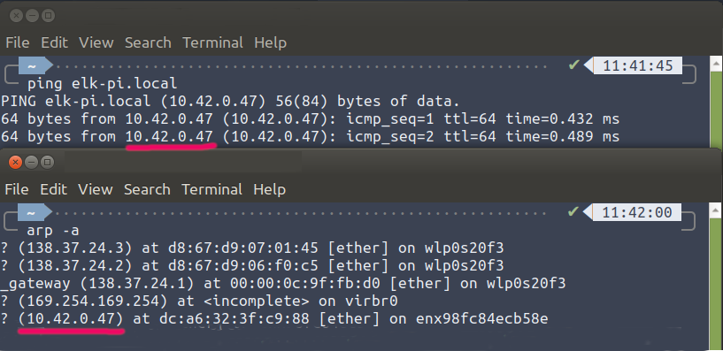
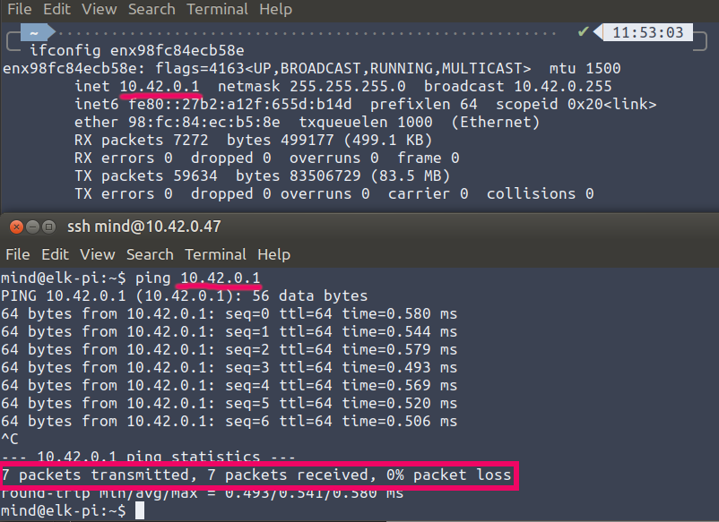
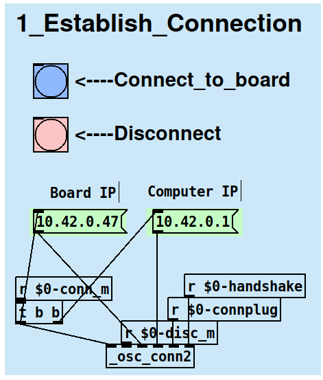
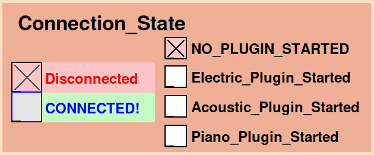
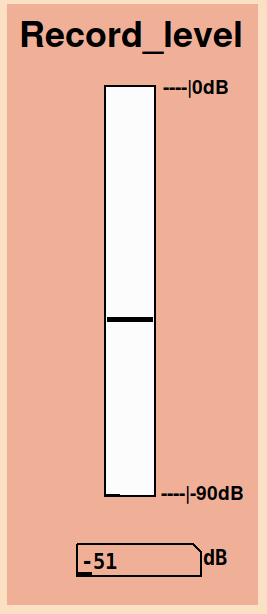

TODO: update after reorganizing the repo
# emotionally-aware-SMIs
Embedded implementation of an emotion classifier for a Smart Musical Instrument (electric guitar, acoustic guitar and piano).

## Repository organization
- Folder `EmotionClassificationPlugin` contains a JUCE plugin that records audio, extracts features and executes inference with a custom model. It also contains the subfolder `python-osc-server` with the OSC server to run on a Elk Audio OS board, and `libs` with the dependencies.
- Folder `OSCcontroller` contains a Pure Data patch and accompanying abstraction to control the plugin via OSC messages.
- Folder `docs/images` contains images included in this README.

## Dependencies (EmotionClassificationPlugin/libs)

<!-- - zlib - 1.2.13 ([github.com/madler/zlib](https://github.com/madler/zlib) commit `04f42ceca40f73e2978b50e93806c2a18c1281fc`) -->
- **eigen** [3.3.4](https://gitlab.com/libeigen/eigen/-/releases/3.3.4) ([gitlab.com/libeigen/eigen](https://gitlab.com/libeigen/eigen) commit [`3dc3a0ea2d0773af4c0ffd7bbcb21c608e28fcef`](https://gitlab.com/libeigen/eigen/tree/3dc3a0ea2d0773af4c0ffd7bbcb21c608e28fcef))
- **ffmpeg** - [3.4.12](https://github.com/FFmpeg/FFmpeg/releases/tag/n3.4.12) ([github.com/FFmpeg/FFmpeg](https://github.com/FFmpeg/FFmpeg) commit [`872001459cf0a20c6f44105f485d125c8e22fc76`](https://github.com/FFmpeg/FFmpeg/tree/872001459cf0a20c6f44105f485d125c8e22fc76))
- **essentia** - main branch ([github.com/MTG/essentia](https://github.com/MTG/essentia) commit [`32376db9b39d8692509ac58036d0b539b7e`](https://github.com/MTG/essentia/tree/32376db9b39d8692509ac58036d0b539b7e))
- **tflite** - 2.11.0 from [domenicostefani/deep-classf-runtime-wrappers](https://github.com/domenicostefani/deep-classf-runtime-wrappers)

## Instruction to use the Emotion Classification Plugin

The plugin is made to be used both as a headless plugin in [Elk Audio Os](https://www.elk.audio/start) and standalone/VST2/3 plugin on a regular computer (currently only compiled for `linux amd64` though).  
### GUI version
On a regular computer, the usage is straightforward: open the plugin either as a standalone or in a DAW, select the folder where to save the recordings and the neural model, and press the record button. Upon a second press, the recording stops and inference is executed for every 3 seconds of audio.
### Elk OS Version
Since the execution on the Elk board is headless, the plugin is controlled via OSC messages from a desktop or laptop computer (we will refer to this as *controller*). A Pure Data controller application is provided in `OSCcontroller/`.

#### Step-by-step instructions:
1. **Connect the Elk board to a laptop/desktop computer via ethernet cable**. You might need to create a shared ethernet network to communicate with the board and have it set its current date properly.  
**Turn on the board after connecting it**.

2. **Find the IP address of the board**: Find the IP of the board. On a Unix terminal, you can run `$ ping elk-pi.local`, or inspect the output of `$ arp -a`.  
To make sure it's the correct address you can connect via ssh with `$ ssh mind@elk-pi.local` (password is `elk`).  
  

3. **Find the IP address of the controller**: Find the IP of the controller **in the same network** that is shared with the board. You can do this by running `$ ifconfig` on a Unix terminal and looking for the IP address that looks like the one of the board, apart from the last number block. For example, if the board has IP `10.42.0.47`, the controller might have address `10.42.0.1`. To confirm this you can ssh into the controller (see previous step) and ping the address, waiting for a positive response.  
  

4. **Open ports on controller's firewall**: Add rules to the *controller*'s firewall to open the ports used for OSC communication. You should allow incoming traffic on ports `7042` and `9042`. For more security you can limit the traffic to the IP address of the board (make sure it doesn't change though) or the subnet. On a Linux computer with the UFW firewall, if the board has address `10.42.0.47` and the controller has address `10.42.0.1` you can run the following commands:  
`$ sudo ufw allow from 10.42.0.0/16 to any port 7042`  
`$ sudo ufw allow from 10.42.0.0/16 to any port 9042`  
These should also ensure that, if the IP addresses change, the ports are still open given that the subnet is quite loose.
Result:
    ```
    $ ufw status

    To                         Action      From
    --                         ------      ----              
    7042                       ALLOW       10.42.0.0/16              
    9042                       ALLOW       10.42.0.0/16 
    ```
    Outgoing traffic should be allowed by default on any general-purpose computer, but if not, you should enable outgoing traffic for ports `6042`, `8042` and `24024`. More info in [OSC connection notes](#osc-connection-notes)

5. **[Optional] Prepare the list of filenames for your recording session**: In `OSCcontroller/data/filenames.csv` you should write the list of filenames to record. Follow the example in the same folder and use search/replace on a text editor. It's suggested to have a few test names at the beginning to test levels.

6. **Run the controller**: Open the Pure Data patch `OSCcontroller/main.pd` and check on the console that there are no errors. The patch depends on some external libraries like `zexy`, `cyclone`, `iemlib` and `mrpeach`.

7. **Plug the IP addresses and connect**: Put the correct IP addresses in the two message boxes on the top left. Do not use hostnames like "elk-pi.local". Then press the connect button. If everything is correct, the "Connected" toggle in the monitoring area will turn on. The controller is now communicating with a server on the device, no plugin is running yet.  

  


8. **Run a plugin**: Press one of the buttons labeled as "start_[...]_plugin. After a few seconds, the toggle "No plugin started" will turn off while one of the [...]_Plugin_started will turn on it.  
at this point the level meter **must** start moving ever so slightly. If it doesn't, something went wrong and you should check the console of the controller and the board.  
  
To access the board server output you can ssh into the board and run `$ tmux a`. To detach the tmux session use `$ ctrl+b d`.

9. **Set the input gain**: Use the "Recording_gain" slider to set the input gain. The meter will show changes while sound is fed to the board. It's still advised to record a few test take, move them to the computer (via `scp` or `sftp`, see next steps) and check the levels there. **Make sure that there is no clipping** and the level is not too low.

10. **Classify the intended emotion of an improvisation**: Press the "record" button on the controller. The recording will start and the "Plugin state" checkbox array will go from "Idle" to "Recording".  
When you are done, press Stop_and_classify. 
The recording will stop and the plugin will start classifying the audio. The "Plugin state" checkbox array will go from "Recording" to "Classifying" and then back to "Idle".

11. **Inspect results**: After a short while, the "Results" canvas will show the predicted emotion for the improvised recording. There can be a single emotion or multiple ones in the case of an ambivalent prediction.  
For a more in-depth analysis or debut, you can check the [Audacity](https://www.audacityteam.org/) label files in the `/udata/emoAwSMIs-recordings folder on the board`. These can be loaded in Audacity along with the recording found in the same folder. For each audio file, there are 2 label files where the first one will show the framewise result, while the second will show the actual framewise network output (Which should be a SoftMax array).  
*Note:* A result will be ambivalent if the maximum softmax output (averaged over every 3-second frame) is closer than a thresholding distance from the second maximum. This threshold is set to 1/7 by default. In this case, all the emotions within the threshold distance from the maximum will be shown.

12. **[Optional] RENAME THE RECORDING**: If, for experiment purposes, you want to give specific names to the recording (with the list defined in step 5) you should do it now. **Warning:** every new recording is considered "unnamed" but it is kept if you record multiple tracks. **However**, to rename a track successfully there must be one and only one unnamed track. This is to make sure to avoid renaming mistakes.  
For this step, inspect closely the output in the Pd console. Clear it if needed (`Ctrl+Shift+L`).
On the purple area of the controller, press Print to see the next filename prepared. Press "Rename & prepare NextName" to rename the last and only unnamed recording track.  
If there is an error (no unnamed track, or more than one) a light will blink a few times and the console will show details.  
If the operation was successful, the "Renamed OK" toggle will turn on.

13. **[Optional] Copy the recordings to a computer**: To copy the recordings to a computer, you can use the `scp` command on a Unix terminal. If there was no error in the process, all the tracks are in the `/udata/emoAwSMIs-recordings/RENAMED/` folder. This includes also the Audacity label files and a log file with the renaming details.
If there was an error in renaming, the tracks with their original names are stored in `/udata/emoAwSMIs-recordings/backup/`. Tracks deleted with the "Delete last track" button are stored in `/udata/emoAwSMIs-recordings/trashcan/`.
___

## OSC connection notes
Here are some additional info about how the OSC controller communicates with the board and the plugin.
More details about the OSC communication procedure can be found in [docs/images/OSCcomm1.png](docs/images/OSCcomm1.png) and [docs/images/OSCcomm2.png](docs/images/OSCcomm2.png).
- Ports `6042` and `7042` are used to communicate with the Python OSC server that oversees plugin start/stop operations, file renaming and deletion (communication uses a 2-way handshake (osc /pyshake) to verify successful connection).
- Ports `8042` and `9042` are used to communicate with the plugin itself to receive loudness metering, plugin status and classification results (communication uses a 2-way handshake (osc /handshake) to verify successful plugin startup).
- Port `24024` is the default port used by the Sushi DAW in Elk Audio OS to set the parameters exposed by VST plugins. It's used to start/stop recording (setting the recstate parameter to 1 or 0), and input gain (linear, [0-1]).

___
## References

1. Turchet, L., & Pauwels, J. (2021). Music emotion recognition: intention of composers-performers versus perception of musicians, non-musicians, and listening machines. IEEE/ACM Transactions on Audio, Speech, and Language Processing, 30, 305-316.